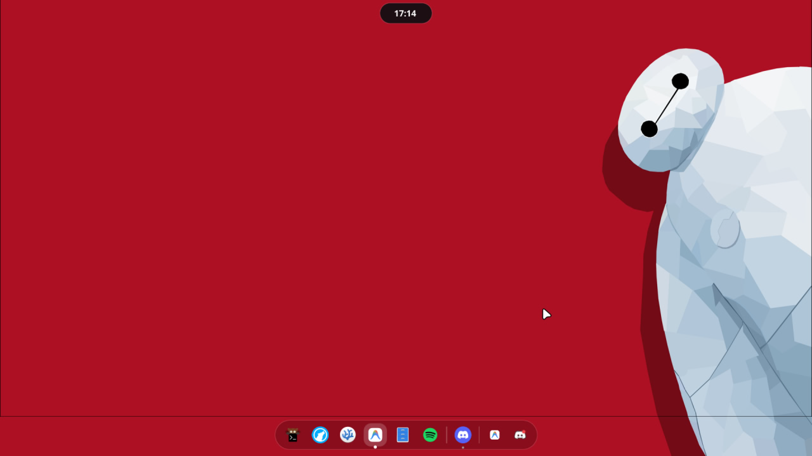
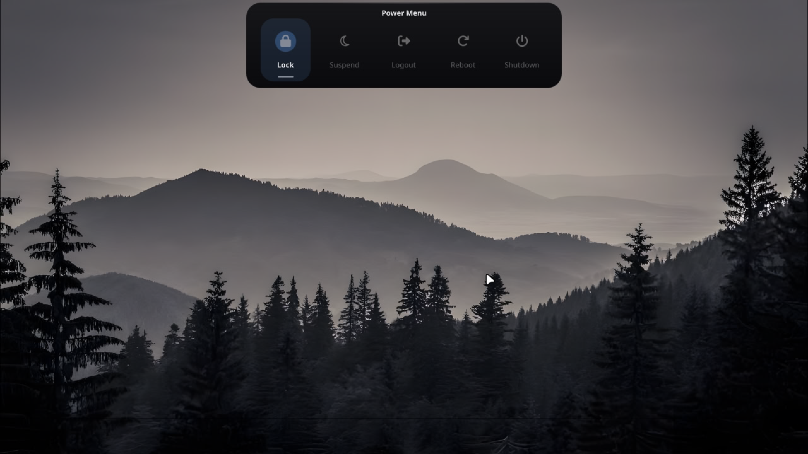
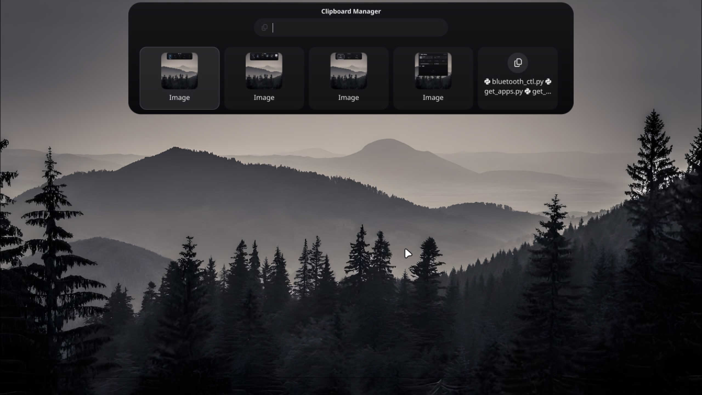
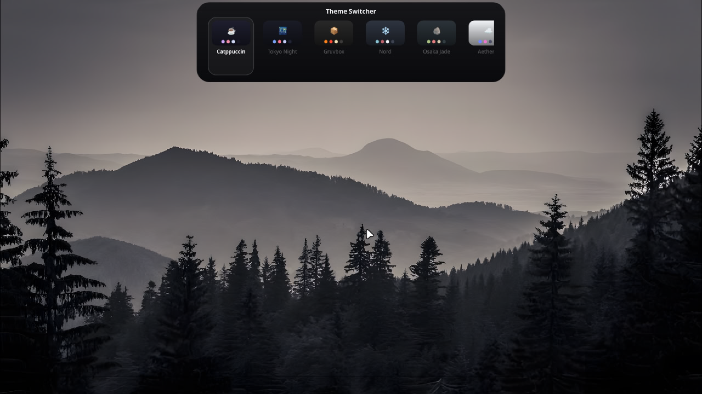
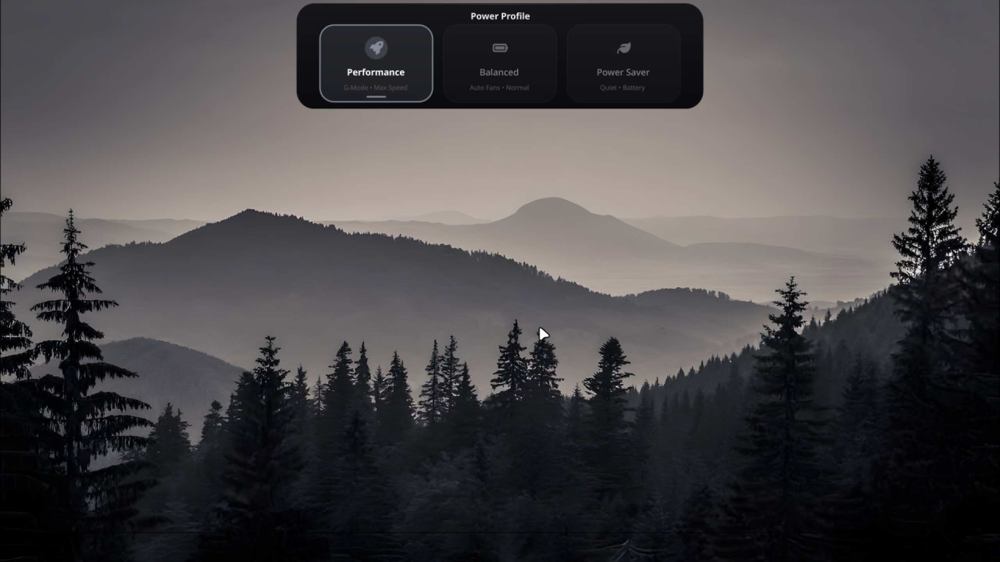
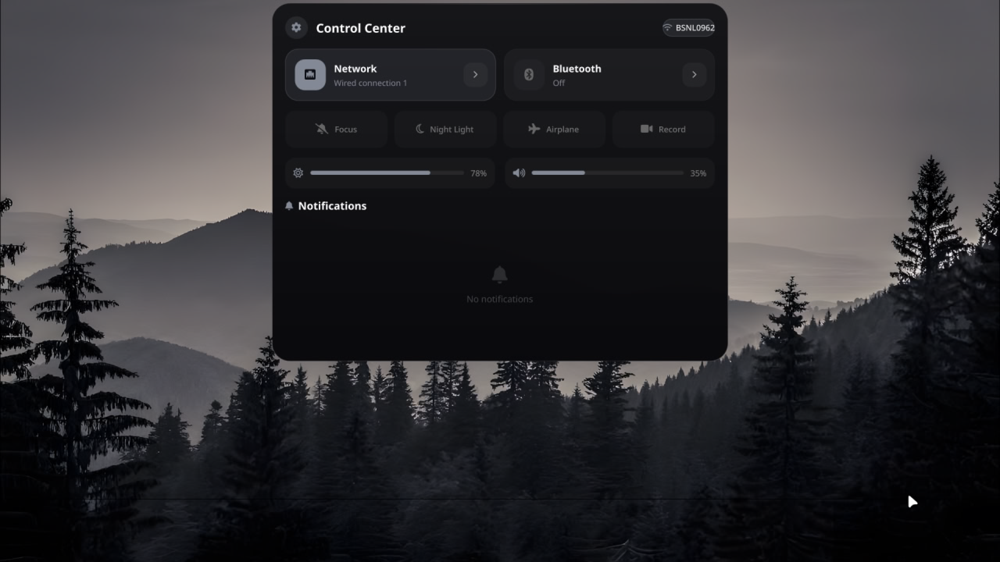
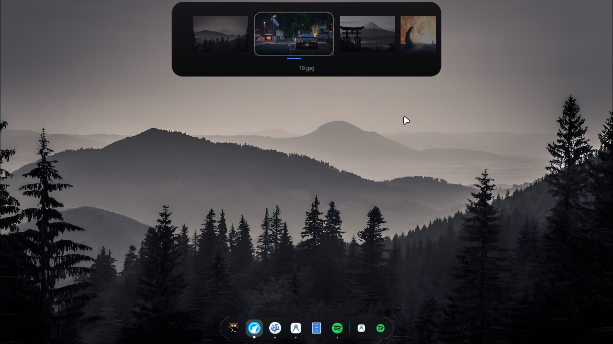

<div align="center">
  <h1>Zen Shell 🏝️</h1>
  <p><b>A highly modular, ultra-sleek, glassmorphic Dynamic Island built for Hyprland using Quickshell.</b></p>
  
  <p>
    
    
    
  </p>
</div>

---

Zen Shell brings the premium feel of a Dynamic Island to your Linux desktop, blending seamlessly into your workflow with ultra-smooth animations, a modular backend, and a stunning glassmorphic UI.

## ✨ Features

- **Interactive Dynamic Island**: Automatically expands for Now Playing media, active Notifications, and precise Volume/Brightness OSD controls.
- **App Launcher**: Instant search through all your `.desktop` entries with a clean, grid-based layout.
- **Control Center**: Seamless toggles for Wi-Fi, Bluetooth, Caffeine mode, and Microphone muting, all synchronized perfectly with your system in real-time.
- **Keybinds Cheatsheet**: A live, searchable index of your `hyprland` shortcuts, dynamically mapped to clean, human-readable actions.
- **Clipboard Manager**: Powered by `cliphist`, view and decode your recent clipboard history instantly.
- **Wallpaper & Theme Selectors**: Change your entire system's aesthetic on the fly.
- **Python-Powered Backend**: Heavy lifting (network scanning, lyrics fetching, clipboard decoding) is offloaded to fast, modular Python scripts stored neatly in the `scripts/` directory.

## 📸 Previews

Below are some previews of Zen Shell in action!

<p align="center">
  
  
</p>
<p align="center">
  
  
</p>
<p align="center">
  
  
</p>
<p align="center">
  
</p>

## 🚀 One-Click Installation

To make getting started as easy as possible, Zen Shell includes a robust, automated installation script. 

The installer will safely backup any existing configurations, resolve all your system dependencies (via `yay` or `paru`), and ensure all scripts have the correct execution permissions.

Simply run the following command in your terminal:

```bash
git clone https://github.com/zenXD45/Zen-Shell.git ~/.config/quickshell/dynamic-island
~/.config/quickshell/dynamic-island/install.sh
```

*(Note: If you run into a password prompt, it's just your AUR helper safely fetching missing dependencies like `socat` or `playerctl`!)*

## ⚙️ Hyprland Integration

Once installed, you must tell Hyprland to launch Zen Shell on boot. Add the following lines to your `hyprland.conf` (or your Lua equivalent):

```ini
# Start the background daemon monitors
exec-once = ~/.config/quickshell/dynamic-island/start_monitors.sh

# Launch the Quickshell UI
exec-once = quickshell -p ~/.config/quickshell/dynamic-island
```

### Keybind Setup

You can bind the different modules to whatever keys you prefer! Here is a recommended configuration:

```ini
# App Launcher
bind = SUPER, Space, exec, ~/.config/quickshell/dynamic-island/island_ctl.sh launcher

# Keybinds Cheatsheet
bind = SUPER, comma, exec, ~/.config/quickshell/dynamic-island/island_ctl.sh cheatsheet

# Clipboard Manager
bind = SUPER, V, exec, ~/.config/quickshell/dynamic-island/island_ctl.sh clipboard

# Control Center
bind = SUPER_SHIFT, N, exec, ~/.config/quickshell/dynamic-island/island_ctl.sh control_center

# Power Menu
bind = SUPER, Escape, exec, ~/.config/quickshell/dynamic-island/island_ctl.sh power
```

## 🛠️ Directory Structure

The repository is built to be extremely clean and easy to modify:
- `shell.qml`: The main Quickshell entry point and root window logic.
- `island_ctl.sh`: The core bash controller for opening/closing modules via IPC.
- `components/`: All modular QML UI elements (e.g. `AppLauncher.qml`, `ControlPanel.qml`).
- `scripts/`: Modular backend scripts (Python/Bash) that handle system data parsing.
- `assets/`: Upscaled screenshots and repository imagery.

Enjoy your beautiful new desktop!
